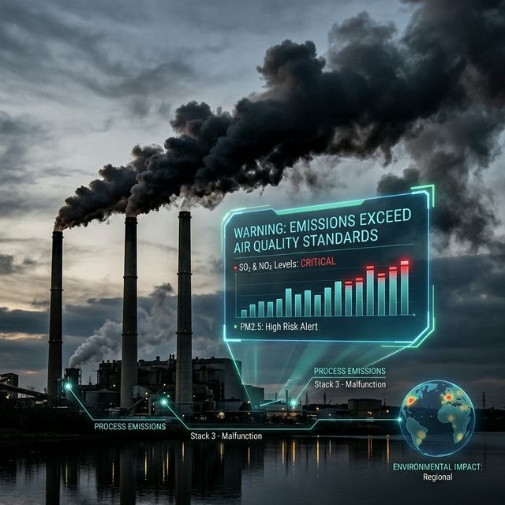
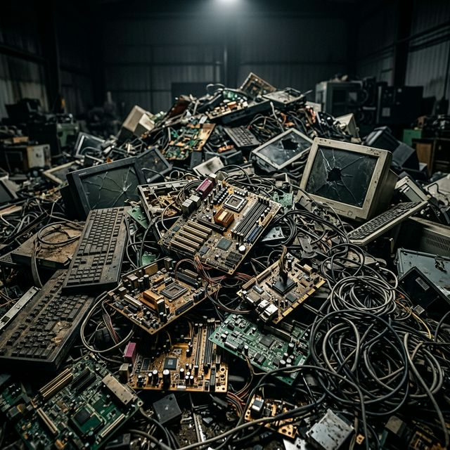
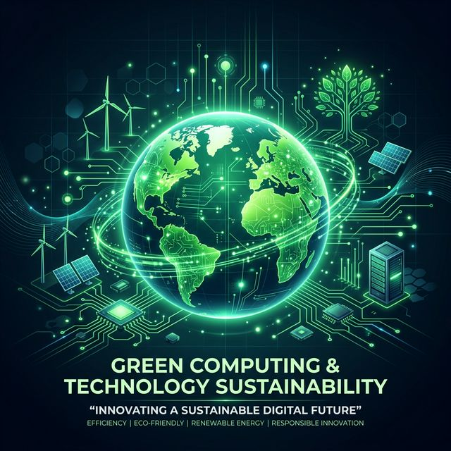

  <h1>🌿 Impacto Ambiental y Tecnología: Hacia una Informática Sostenible</h1>
  
<b>Documento de Investigación y Análisis</b> | Área: <i>Sistemas Informáticos (SI)</i>

### 📑 Índice Ejecutivo
- [1. 🌍 ¿Qué es la contaminación ambiental?](#1--qué-es-la-contaminación-ambiental)
- [2. 🔋 Residuos Informáticos (E-Waste)](#2--residuos-informáticos-e-waste)
  - [Impacto Global y Nivel de Toxicidad ☣️](#impacto-global-y-nivel-de-toxicidad-️)
- [3. ⚙️ Obsolescencia Programada](#3-️-obsolescencia-programada)
  - [Autores Claves y Tipologías 📚](#autores-claves-y-tipologías-)
- [4. 🌱 Informática Ecológica (Green Computing)](#4--informática-ecológica-green-computing)
  - [Los Pilares Maestros y Ejemplos de Implementación del *Green IT*:](#los-pilares-maestros-y-ejemplos-de-implementación-del-green-it)
- [5. 📘 Referencias Académicas, Fuentes y Bibliografía](#5--referencias-académicas-fuentes-y-bibliografía)

## 1. 🌍 ¿Qué es la contaminación ambiental?

> **Definición Clave:** La contaminación ambiental es la introducción de sustancias, compuestos físicos o energía (como el calor o irradiación) en un medio, de manera que éste se vuelve inseguro, tóxico o no apto para su uso orgánico y ecológico. 

Según el **Programa de las Naciones Unidas para el Medio Ambiente (PNUMA)**, la contaminación ha escalado hasta convertirse en el mayor riesgo documentado para la salud planetaria, con impactos irreversibles a nivel biológico, económico y social. El avance tecnológico no controlado interviene directamente en tres frentes:

* **🌬️ Atmosférica:** Emisión de Gases de Efecto Invernadero (GEI) procedentes de la manufactura masiva e industrialización.
* **💧 Hídrica y de los Suelos:** Desechos industriales arrojados por las plantas tecnológicas que comprometen directamente acuíferos, mares y capacidad agrícola territorial.
* **📡 Tecnológica y Electrónica:** Derivada de la minería indiscriminada subyacente y del descarte final de dispositivos y placas base.

---

## 2. 🔋 Residuos Informáticos (E-Waste)

Los **residuos informáticos**, comúnmente denominados chatarra electrónica o *e-waste*, abarcan la totalidad de aparatos ofimáticos, teléfonos móviles, componentes informáticos de hardware y electrodomésticos que han sido descartados o han alcanzado el fin de su vida útil operativa.

### Impacto Global y Nivel de Toxicidad ☣️
Según el prestigioso documento **The Global E-waste Monitor** auspiciado por la ONU, la humanidad genera actualmente más de **53,6 millones de toneladas métricas** de basura electrónica al año (y la estadística escala exponencialmente). Cifras de alarma indican que solo alrededor de un **17% se recicla** formalmente y de forma segura.

Estos aparatos esconden materiales altamente tóxicos que, al ser expuestos en vertederos no regulados del Sur global (verbigracia Agbogbloshie en Ghana), afectan críticamente la salud humana, a las comunidades circundantes, y a la fauna:
* **🔴 Plomo (Pb) y Mercurio (Hg):** Neurotóxicos fulminantes presentes comúnmente en soldaduras y monitores.
* **🔴 Cadmio (Cd) y Berilio (Be):** Compuestos fuertemente carcinógenos.
* **🔴 Retardantes de llama bromados (BFR):** Disruptores severos del sistema endocrino humano expuestos al calor o rotura.

> *"La basura electrónica representa uno de los flujos de desechos de mayor crecimiento y peligrosidad intrínseca en el mundo moderno."* — **Organización Mundial de la Salud (OMS)**.

---

## 3. ⚙️ Obsolescencia Programada

La **obsolescencia programada** (o planificada) es la agresiva estrategia corporativa de establecer y diseñar el final de la vida útil comercial de un producto directamente, haciéndolo de manera premeditada en la fase de ingeniería de diseño. El propósito es netamente lucrativo y cíclico: conseguir que el hardware se vuelva obsoleto, deficiente o artificialmente incompatible tras un periodo específico calculado en calendario para obligar al usuario a recomprar. 

Este pilar fundamental de la *"ingeniería del fracaso"* es el motor subyacente que mantiene girando la rueda del consumo tecnológico masivo moderno.

### Autores Claves y Tipologías 📚
El paradigma fue conceptualizado en un marco socioeconómico por el ensayista y estratega inmobiliario **Bernard London** en su innovador artículo de 1932 *"Ending the Depression Through Planned Obsolescence"*. Años después, el brillante sociólogo **Vance Packard**, a través de su obra literaria magna *"The Waste Makers"* (1960), documentó y condenó el avance de estas prácticas, dividiéndolas de manera visionaria en facetas perfectamente aplicables al marco IT contemporáneo:

1. **🛠️ Obsolescencia Funcional (Técnica):** Inserción premeditada de fallas de hardware, debilidades estructurales, o ensamblajes hostiles. Por ejemplo: pegamentos fuertes en lugar de tornillos en las baterías corporativas, imposibilitando su reemplazo sencillo o seguro; microprocesadores soldados indisolublemente; y **obsolescencia por software**, limitando mediante actualizaciones o negando las mismas para ralentizar o incapacitar operativament el equipo.
2. **🛍️ Obsolescencia de Deseabilidad (Psicológica):** Publicidad y marketing orientados a la percepción social, donde un producto íntegramente funcional es publicitado como inaceptable, anticuado o no válido, simplemente ante la presencia del próximo modelo superior (modelo cosmético).

Hoy en día, instituciones de ética tecnológica, como el entorno promovido por el CEO **Kyle Wiens** en **iFixit** junto a amplias comisiones europeas organizadas bajo el emblema **"Right to Repair"**, disputan agresivas batallas técnico-legales frente a empresas para devolver la circularidad y extender la operatividad del *hardware*.

---

## 4. 🌱 Informática Ecológica (Green Computing)

Como un contrapeso pragmático e ineludible en el ámbito TI frente a todas y cada una de las debilidades descritas anteriormente, surge la **Informática Ecológica** (o *Green IT*). Se define como la disciplina informática encargada de investigar, diseñar, implementar y regular la manufactura y desmantelamiento de todas las tecnologías y metodologías subyacentes con un único principio rector: **la máxima reducción del impacto medioambiental acercando la externalización al cero neto** (Net Zero) frente al ecosistema. El hardware se convierte en una herramienta ecológica transicional, y la empresa optimiza costes indirectos y consumos tangibles operacionales (disminuyendo el llamado TCO en materia de eficiencia y calor residual).

### Los Pilares Maestros y Ejemplos de Implementación del *Green IT*:
* **♻️ Ecodiseño (Green Design) e Ingeniería Abierta:** Foco absoluto en la investigación de materiales base biodegradables (como bioplásticos derivados del maíz), sustitución integral por ley (*RoHS compliance*) de cadmios y haluros metálicos en sistemas de conducción o disipación, además de la promulgación legal de equipos completamente **modulares y de arquitectura abierta** con vistas a un ciclo de vida ampliado. 
* **⚡ Eficiencia Energética (Green Use y PUE):** Optimización intensiva y quirúrgica del consumo bruto energético de plataformas empresariales o *Datacenters*. Solo los Centros de Datos suponen alrededor de un 2% a 3% del gigantesco consumo eléctrico orbital; este factor propició que los mundialmente célebres ingenieros de infraestructura masiva como **Luiz André Barroso** y **Urs Hölzle** redefinieran radicalmente la escala computacional con la implantación de sus *Warehouse-Scale Computers* en conglomerados globales impulsados puramente en algoritmos de refrigeración Inteligente o el empleo de corrientes termales oceánicas naturales. Su trabajo ha permitido disminuciones operacionales en algunos datacenters hipervisorizados del entorno del 40% (índice métrico fundamental: el *PUE*).
* **🖥️ Virtualización y Consolidación Arquitectural:** Supresión efectiva de miles de servidores físicos inutilizados o encendidos de forma inútil y redundante en el llamado *server sprawl*. Un ingeniero de SI consolidará estos sistemas alocando e implementado robustos entornos Hipervisores centrales (como KVM, Hyper-V o infraestructuras ESXi/Proxmox) centralizando procesos de máquina y software de forma unificada pero independientemente estricta dentro de los menores parámetros de un clúster *hardware* posible.
* **🚚 Disposición y Cierre de Ciclo Responsable (Green Disposal):** Políticas públicas o incentivos organizacionales de retro-reciclaje integral. Consiste en esquemas formalizados gubernamentales como los *Trade-in o e-cycling* o depósitos de fin de ciclo para recuperación mineral de nivel oro, paladio y plata corporativos de manera limpia y sin perjuicio ambiental alguno, cerrando efectivamente así el marco y ciclo circular ecológico.

---

## 5. 📘 Referencias Académicas, Fuentes y Bibliografía

Para dotar al documento del máximo estándar y requerimientos de rigor profesional así como respaldar la investigación objetivamente, a continuación se enumeran en orden relevante las obras de consulta primarias:

1. **London, B. (1932).** *Ending the Depression Through Planned Obsolescence*. Ensayo inicial capitalista sobre forzamiento de consumo planificado ante recesiones sistémicas. 
2. **Packard, V. (1960).** *The Waste Makers (Los artífices del derroche)*. Ig Publishing. Libro y ensayo fundamental y precursor de las críticas ante la manipulación socio-económica y mediática del consumo masivo. 
3. **Baldé, C. P., Forti V., Gray, V., Kuehr, R., Stegmann, P. (2020).** *The Global E-waste Monitor - Quantities, flows, and the circular economy potential*. United Nations University (UNU), UNITAR, y UIT. Completo estudio global y demográfico mundial analizando la trazabilidad real de la contaminación de tipo electrónica en los flujos globales (E-waste). — [Visitar Monitor Oficial](https://globalewaste.org/).
4. **Programa de las Naciones Unidas para el Medio Ambiente (PNUMA)**. Portal e instituto global de estudios macro en los dominios del impacto demográfico, biológico y social para la Tierra y sus biosferas frente al peso tecnológico. — [UNEP Global Frameworks](https://www.unep.org/).
5. **Barroso, L. A., & Hölzle, U. (2009).** *The Datacenter as a Computer: An Introduction to the Design of Warehouse-Scale Machines*. Literarura y documentación referencial sumamente crítica elaborada por los ingenieros pioneros para la comprensión e implementación técnica macro del *Green Computing* en arquitectura industrial.
6. **Coalición Right to Repair Europe**. Agrupación de carácter social, ingenieril y legislativa apoyada e impulsada sistemáticamente a favor de los derechos democráticos de mantenimiento al consumidor exigiendo por vía de reglamentos la implantación de una tecnología altamente reparable, longeva, circular y libre. — [Iniciativa Right to Repair EU](https://repair.eu/).

